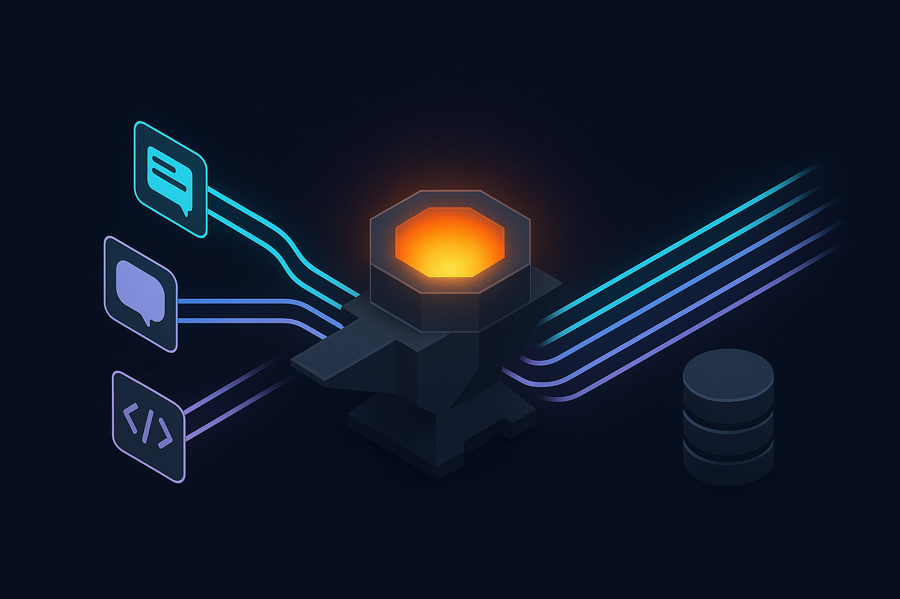
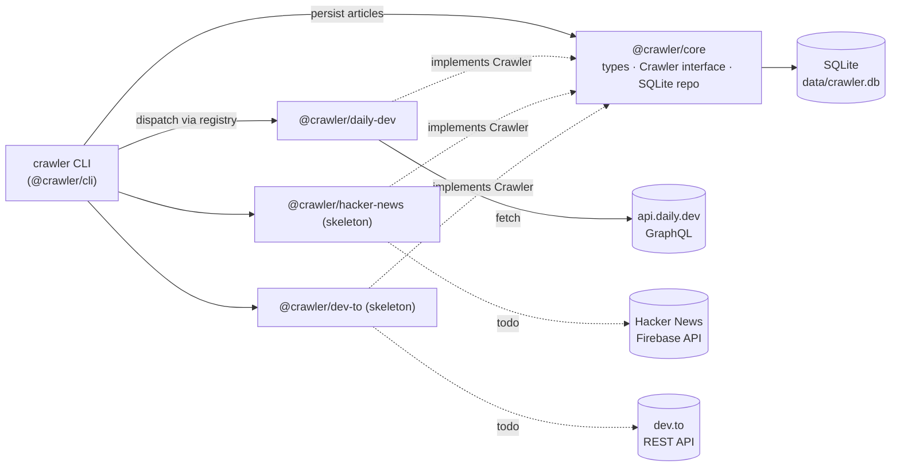

<div align="center">



# feedforge

**Multi-site article crawler.** One package per site in a pnpm monorepo. Stores URLs, summaries, and metadata in SQLite. Single-command CLI.

[](https://nodejs.org)
[](https://www.typescriptlang.org)
[](https://pnpm.io)
[](https://www.sqlite.org)
[](LICENSE)

</div>

---

## Supported sites

| Site | Status | Source |
|---|---|---|
| `daily-dev` | ✅ Full | Public GraphQL API (popular feed + tag search) |
| `hacker-news` | 🚧 Skeleton | Outline ready — fill in the API logic |
| `dev-to` | 🚧 Skeleton | Outline ready — fill in the API logic |

---

## Quick start

```bash
git clone <repo>
cd crawler
pnpm install
pnpm cli crawl daily-dev --feed popular --limit 10
pnpm cli list --source daily-dev
```

Default DB lives at `data/crawler.db` in the repo root.

---

## Architecture



```
crawler/
├── README.md
├── package.json                    # pnpm workspace, scripts, build whitelist
├── pnpm-workspace.yaml
├── tsconfig.base.json
├── data/crawler.db                 # SQLite (gitignored)
└── packages/
    ├── core/                       @crawler/core      Article type, Crawler interface, SQLite repo
    ├── daily-dev/                  @crawler/daily-dev GraphQL client + crawler (full)
    ├── hacker-news/                @crawler/hacker-news (skeleton template)
    ├── dev-to/                     @crawler/dev-to    (skeleton template)
    └── cli/                        @crawler/cli       commander dispatcher + registry
```

**SQLite schema** (see `packages/core/src/migrations.ts`):

- `articles` — id, source, external_id, url, permalink, title, summary, author, publisher, publisher_image, image_url, published_at, crawled_at, raw_json. UNIQUE(source, external_id).
- `article_tags` — article_id, tag.
- Indexes: source, published_at, tag.

**Dedupe**: `(source, external_id)` UNIQUE → re-running the same command yields 0 inserted, N updated. `crawled_at` is preserved on update (first-seen semantics), so list ordering stays stable across re-crawls.

---

## CLI reference

### `crawler crawl <site>`

| Option | Default | Description |
|---|---|---|
| `--feed <type>` | `popular` | `popular` or `search` |
| `--tag <name>` | — | Required when `--feed=search` |
| `--limit <n>` | `50` | Max articles to fetch |
| `--db <path>` | `data/crawler.db` | Override DB path (relative to cwd or absolute) |

```bash
pnpm cli crawl daily-dev --feed popular --limit 50
pnpm cli crawl daily-dev --feed search --tag javascript --limit 100
CRAWLER_DB=/tmp/test.db pnpm cli crawl daily-dev --limit 5
```

### `crawler list`

| Option | Default | Description |
|---|---|---|
| `--source <name>` | (required) | e.g. `daily-dev` |
| `--limit <n>` | `10` | Rows to show |
| `--offset <n>` | `0` | Pagination offset |
| `--truncate <n>` | (none — full) | Truncate summary to N chars |
| `--json` | `false` | Print JSON array (full row + tags + raw_json) |
| `--db <path>` | `data/crawler.db` | Override DB path |

```bash
pnpm cli list --source daily-dev --limit 20
pnpm cli list --source daily-dev --limit 20 --truncate 140
pnpm cli list --source daily-dev --json | jq '.[].title'
```

### Exit codes

| Code | Meaning |
|---|---|
| `0` | success |
| `1` | user error (bad flag, unknown site, missing tag) |
| `2` | runtime error (network, DB, etc.) |

---

## Adding a new site

### Option A — Start from a skeleton (≤ 5 min wiring)

```mermaid
flowchart LR
    A[Copy<br/>packages/hacker-news] --> B[Rename<br/>package.json + class + SOURCE_NAME]
    B --> C[Implement crawl()<br/>following the outline]
    C --> D[Update<br/>cli/registry.ts<br/>+ cli/package.json]
    D --> E[pnpm install]
    E --> F[pnpm cli crawl &lt;site&gt;]
```

1. Copy `packages/hacker-news/` (or `dev-to/`) to `packages/<your-site>/`.
2. Rename `name` in `package.json` to `@crawler/<your-site>`.
3. Rename the class and `SOURCE_NAME` in `src/crawler.ts`.
4. Implement `crawl()` following the in-file outline (endpoints, field mappings, throttle hints are pre-written).
5. Add one line to `packages/cli/src/registry.ts` and one line to `packages/cli/package.json`.
6. `pnpm install` → `pnpm cli crawl <your-site> --limit 5`.

### Option B — Copy the full implementation

Copy `packages/daily-dev/` for a richer pattern (GraphQL, zod validation, retry/throttle, pagination):

```
packages/daily-dev/src/
├── client.ts       HTTP/GraphQL client with throttle + retry
├── queries.ts      GraphQL strings
├── schema.ts       zod schemas validating responses
├── mapper.ts       upstream payload → Article
├── crawler.ts      class implements Crawler, async generator
└── __tests__/      unit tests + fixture JSON
```

Standard pattern: **client → query → zod schema → mapper → AsyncIterable<Article>**.

### Conventions

- No need to touch `packages/core/` — only add a new package and one registry line.
- Site names must be kebab-case and stable (they're stored in the DB `source` column).
- `externalId` must be unique per site (the dedupe key is `(source, external_id)`).
- Stash the raw payload in `rawJson` so future schema additions can be backfilled without re-crawling.

---

## Requirements

- Node.js ≥ 18.18 (tested on Node 23.11 / Windows)
- pnpm ≥ 9 — `npm install -g pnpm`
- Build tools for `better-sqlite3` (only needed if no prebuilt binary is available):
  - **Windows:** Visual Studio Build Tools with the C++ workload
  - **macOS:** `xcode-select --install`
  - **Linux:** `build-essential` + `python3`

`better-sqlite3` is whitelisted in `pnpm.onlyBuiltDependencies` so its install script runs.

---

## Development

```bash
pnpm typecheck                          # tsc --noEmit across the workspace
pnpm test                               # vitest run for every package
pnpm --filter @crawler/core test
pnpm --filter @crawler/daily-dev test
```

Current test status: **22/22 unit tests pass** (core: 8, daily-dev: 9, cli: 5).

---

## Troubleshooting

<details>
<summary><b><code>better-sqlite3</code> build fails / "Could not locate the bindings file"</b></summary>

- Install Visual Studio Build Tools (Windows) / Xcode CLI Tools (macOS) / `build-essential` (Linux).
- Run `pnpm rebuild better-sqlite3` to rebuild the native binding.
- Verify that `node_modules/.pnpm/better-sqlite3@*/node_modules/better-sqlite3/build/Release/better_sqlite3.node` exists.

</details>

<details>
<summary><b><code>429 Too Many Requests</code> from daily.dev</b></summary>

The crawler already throttles to 1 req/s with exponential-backoff retry. If 429s persist, raise `throttleMs` when constructing `DailyDevClient`.

</details>

<details>
<summary><b><code>database is locked</code></b></summary>

WAL mode is on. Make sure no other process holds the DB open; close stale connections and retry.

</details>

<details>
<summary><b>Upstream schema changed</b></summary>

- If the zod schema fails to parse, inspect the raw response and update `packages/<site>/src/schema.ts` (keep older fields backwards-compatible via `.optional()` / `.nullable()`).
- `raw_json` stores the full upstream payload, so new columns can be backfilled without re-crawling.

</details>

---

## License

[MIT](LICENSE) © 2026
